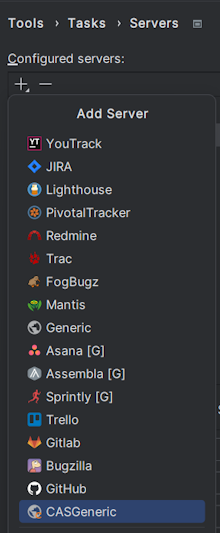

# tasks-plugin-for-CAS

A plugin for IDE based on the IntelliJ platform adds the ability to log
in to bugtrackers (YouTrack, Jira, Redmine, etc.) via [CAS](https://apereo.github.io/cas).

Extends the built-in [Task Management](https://plugins.jetbrains.com/plugin/11545-task-management) plugin.

After installation, in the settings (`Settings -> Tools -> Tasks -> Servers`), CASGeneric appears in the list of servers,
which allows you to configure connection to different bugtrackers.

You can read more about the features and settings of the built-in `Task Management` plugin
[here](https://www.jetbrains.com/help/idea/managing-tasks-and-context.html).

## Configuring

Plugin can be configured via `Settings -> Tools -> Tasks -> Servers`.
Add the `CASGeneric` server.
In the `Server Configuration` tab, in the `CAS Server URL` field, specify the url of your CAS,
you can take it from the authorization page (without `/login`).
For example, in my case it looks like this `https://cas.mycompany.com/cas-server-webapp-0.0.0`.

The rest of the setup does not differ from the same for `Generic`,
described in more detail [here](https://www.jetbrains.com/help/idea/tutorial-configuring-generic-task-server.html).

To test the connection, you can click on the `Test` button on the `General` tab.

The session for working with the bugtracker opens at the first request or test and runs until the IDE is closed.
If you have already successfully logged in earlier, but decided to change your account,
then to log in again, click the `Relogin` button in the `General` tab.
